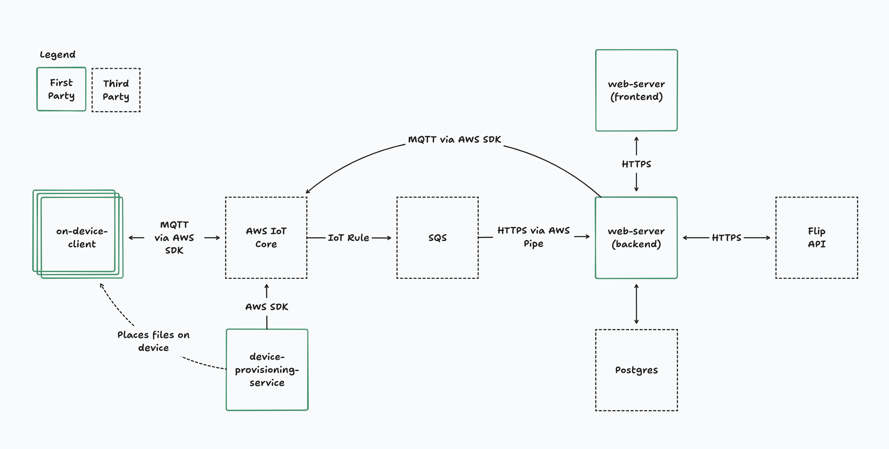

# flip.energy AWS demo

This repo contains a prototype of energy devices interacting with https://flip.energy/.

# Architecture



The major architectural pieces of the the prototype are divided into top-level directories:

- `device-provisioning-service` contains scripts to use AWS SDKs to create AWS IoT Things along with their associated certificates. The certificate and device metadata is then used to run mock devices.
- `on-device-client` contains scripts to run mock devices. While running, mock devices will report telemetry to the Flip API via the `web-server` directory. This directory also contains code to generate signed registration URLs for users to register their devices.
- `web-server` contains a Next.JS application to register devices, forward telemetry information from devices to the Flip API, and forward Flip API webhook messages to devices. This is also where devices are enrolled in incentive programs.
- `terraform` contains the Terraform configuration required to set up the AWS services to support all of the above.

# Setup

- Create an AWS account
- Create a supabase account
- Download aws cli
- Log in with your aws account using the aws cli

## Apply terraform configuration and populate AWS configuration files

This creates and configures all of the necessary services in AWS. For example,
this creates the IAM roles and users, the provisioning certificate, and the SQS
queue for messages.

This is actually two steps:

1. Create the S3 bucket and dynamodb table needed for terraform to manage its own state via terraform's [S3 backend](https://developer.hashicorp.com/terraform/language/settings/backends/s3). To do this automatically, run:

```
cd terraform
scripts/setup-terraform-backend.sh
```

2. Create all other AWS resources (MQTT channels, SQS queues, IAM roles, etc.)

```
cd terraform
scripts/apply.sh
```

Use your email account you have access to in the terraform setup. This will be
used by supabase to send authentication related emails.

## Configure supabase authentication

### Configuring email templates in Supabase

The recommended authentication mechanism for server side rendering in Supabase uses
manual OTP verification for passwordless email authentication. To make this work, you
need to modify the email templates Supabase uses by default.

To do this:

1. Go to the [Auth templates](https://supabase.com/dashboard/project/_/auth/templates) page in your Supabase dashboard.
2. In the `Magic link` tempalte, change `{{ .ConfirmationURL }}` to `{{ .SiteURL }}/auth/confirm?token_hash={{ .TokenHash }}&type=magiclink&redirect_to={{ .RedirectTo }}`
3. Update the [Redirect URLs list](https://supabase.com/dashboard/project/_/auth/url-configuration) to include `http://localhost:3000/**`.

See: https://supabase.com/docs/guides/auth/server-side/nextjs?queryGroups=router&router=app

### Configuring SMTP configuration in Supabase (optional)

Supabase has extremely [restrictive rate
limits](https://supabase.com/docs/guides/auth/auth-smtp) for sending emails.
This can make debugging issues related to authentication annoying. To work
around this problem, you can configure [Amazon SES](https://aws.amazon.com/ses/)
for email sending.

The relevant SES keys can be found in the terraform output after running
`apply.sh` by looking in `terraform/output/aws-config.json`:

- `smtp_host`
- `smtp_username`
- `smtp_password`

Take these values and `Enable Custom SMTP` on the [Auth settings
page](https://supabase.com/dashboard/project/_/settings/auth) on Supabase. For
the sender email, choose the same email you entered into the terraform
configuration.

## Set up environment variables

For the Next.JS app to boot, environment variables must be set in a `.env` file.
See comments in `safe-env.ts` for where to retrieve these.

## Configure Flip webhook URL

In order for Flip to be able to send commands to your server, you need to
configure the webhook URL through Flip's interface. For testing locally,
use [ngrok](https://ngrok.com/).

# Workflows

## Provision a device

Provisioning a device means "create a device in AWS IoT Core, and generate the
files needed on-device to communicate". In a real production environment, this
would be part of the manufacturing process. This is where e.g. the
device-specific certificates are created to be flashed onto the device.

    cd device-provisioning-service
    npm install
    npm run provision-device -- my-cool-battery device-artifacts/my-cool-battery

## Boot a device

In a real production environment, this would be equivalent to turning on the
physical battery (assuming it already has access to the internet). Once running,
devices will begin reporting telemetry back to central servers. Several devices
can be running in parallel.

    cd on-device-client
    npm install
    npm run run-device -- ../device-provisioning-service/device-artifacts/my-cool-battery

## Register and enroll a device

Even after a device is provisioned and started, for a homeowner to enroll it
into VPP programs, physical address information needs to be associated with the
device. To prove the user has physical access to the device, the device
generates a registration URL containing a message signed with the device's
private key. When the registration URL loads, it examines the message to
identify the device, then fetches the device's public key from AWS IoT Core and
verifies the signature. The user can then associate the device with their
account, and commission that device with Flip.

    cd web-server
    npm install
    npm run dev

    cd ../on-device-client
    npm install
    npm run generate-registration-url -- ../device-provisioning-service/device-artifacts/my-cool-battery http://localhost:3000/devices/register

From there, open the URL generated by the script and follow the registration
instructions.

## Handling commands

Once a device is enrolled in a VPP program from Flip, it will be able to receive
commands requesting the device be actuated at a specific time.

The flow for commands being delivered to devices is...

1. The command is sent via an HTTP POST request to the web-server
2. The web-server saves the command to the `commands` table in supabase, along
   with a timestamp indicated when it was received.
3. Whenever a device transmits telemetry to the web server via the MQTT -> SQS
   -> EventBridge Pipe bus, the telemetry message also includes a timestamp
   indicating the last acked comman. This is used to mark `commands` as ACK'd.
4. The web-server then sends an MQTT message to devices containing all pending
   commands. If it isn't received, that's fine, because it will be re-transmitted
   until the device ACKs.

TODO: For greater resiliency, it would be better to have commands received by
Flip be enqueued in SQS via a lambda. Then web server downtime wouldn't prevent
commands from being received. In this case, instead of the data flow being Flip
-> web-server -> MQTT, it would be Flip -> API Gateway -> Lambda -> SQS, and
then separately SQS -> EventBridge Pipe -> web-server. I skipped that in this
implementation since it seemed like overkill for a prototype.
